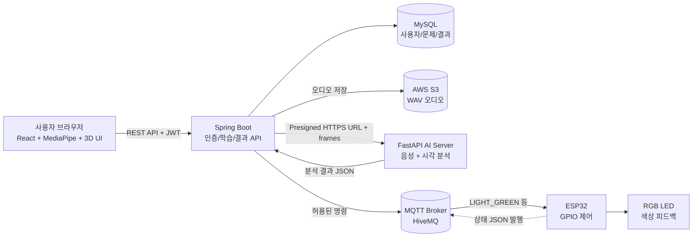
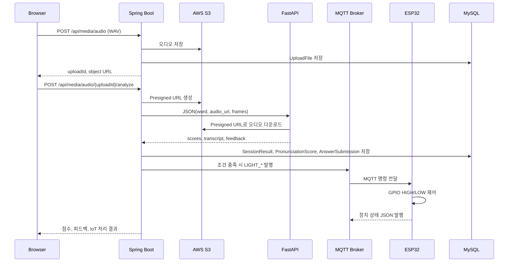
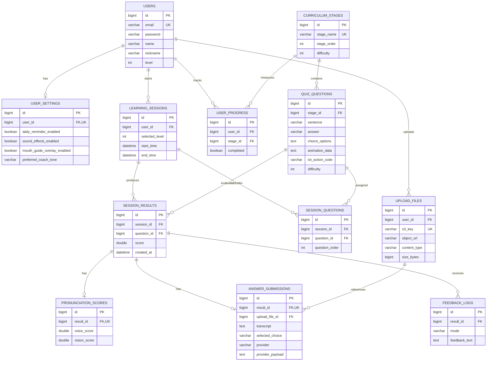

# Pronimo Backend

3D 시각화와 AI 발음 분석을 결합한 영어 발음 교정 학습 서비스 **Pronimo**의 Spring Boot 백엔드입니다.

사용자는 레벨별 문제를 풀고 음성과 MediaPipe 입술 특징값을 제출합니다. 백엔드는 오디오를 S3에 저장한 뒤 FastAPI AI 서버로 분석을 요청하고, 분석 결과를 학습 기록으로 저장합니다. 정답과 발음 점수가 기준을 통과하면 MQTT를 통해 ESP32 RGB LED를 제어하여 학습 결과를 시각적으로 제공합니다.

## Contents

- [프로젝트 소개](#프로젝트-소개)
- [핵심 기능](#핵심-기능)
- [시스템 아키텍처](#시스템-아키텍처)
- [데이터 모델](#데이터-모델)
- [API](#api)
- [AI 분석 계약](#ai-분석-계약)
- [실행 방법](#실행-방법)
- [환경 변수](#환경-변수)
- [트러블슈팅](#트러블슈팅)
- [프로젝트 구조](#프로젝트-구조)
- [향후 개선](#향후-개선)

## 프로젝트 소개

### 배경

기존 발음 학습 서비스는 점수나 텍스트 피드백에 의존하는 경우가 많아 학습자가 실제 발음 과정에서 어떤 부분을 고쳐야 하는지 직관적으로 이해하기 어려웠습니다. Pronimo는 음성 분석과 얼굴·입술 특징값 분석을 함께 사용하고, 3D 구강 애니메이션과 IoT 장치 피드백을 결합하여 발음 교정 과정을 시각화합니다.

### 해결 방향

1. 브라우저에서 음성 녹음과 MediaPipe 프레임 데이터를 수집합니다.
2. Spring Boot가 사용자, 세션, 문제, 업로드 파일을 검증하고 관리합니다.
3. 오디오 파일은 S3에 저장하고 제한된 시간의 Presigned URL을 발급합니다.
4. Spring Boot가 `word`, `audio_url`, `frames` 형식으로 FastAPI AI 서버에 분석을 요청합니다.
5. AI 응답의 종합·음성·시각 점수와 피드백을 데이터베이스에 저장합니다.
6. 정답과 점수가 기준을 통과하면 MQTT 명령을 발행하여 ESP32의 RGB LED를 작동시킵니다.

## 핵심 기능

| 영역 | 기능 |
| --- | --- |
| 인증 | 회원가입, 로그인, JWT 인증, 닉네임 및 사용자 설정 관리 |
| 커리큘럼 | Lv1~Lv15 레벨, 레슨·문제 조회, 레벨 진행도 및 완료 처리 |
| 학습 세션 | 레벨 선택, 10문제 학습 세션, 진행도 조회, 중단 세션 복원 |
| 문제 풀이 | 5개 선택지 제공, 선택 답안 저장, 풀이 결과와 점수 저장 |
| 음성 처리 | WAV 업로드, S3 저장, Presigned URL 발급 |
| AI 분석 | 음성 및 입술 특징값 전달, AI 점수·transcript·피드백 저장 |
| 시각 피드백 | 문제별 `animationData`, 발음 점수, 피드백 조회 |
| 학습 관리 | 대시보드, 학습 기록, 최근 결과, 랭킹, 오답 및 취약 발음 조회 |
| IoT | MQTT를 통한 ESP32 RGB LED 제어 및 장치 상태 메시지 발행 |

## 기술 스택

`Java 17` · `Spring Boot` · `Spring Data JPA` · `MySQL` · `JWT` · `AWS S3` · `FastAPI` · `MQTT` · `ESP32`

## 시스템 아키텍처



### 요청 흐름



### 설계 선택

#### Spring Boot와 FastAPI 분리

AI 분석은 음성 처리와 외부 AI 모델 호출을 포함하므로 일반 학습 API와 처리 특성이 다릅니다. AI 서버를 FastAPI로 분리하여 분석 지연이 회원 인증·학습 세션 API까지 직접 영향을 주지 않도록 했고, AI 모델과 분석 로직을 독립적으로 교체할 수 있도록 구성했습니다.

#### S3 Presigned URL 사용

Spring 서버가 오디오 바이너리를 AI 서버에 직접 중계하지 않고, S3에 업로드한 뒤 제한 시간의 Presigned URL을 전달합니다. 이를 통해 서버 메모리와 네트워크 부담을 줄이고 AI 서버가 필요한 파일만 제한적으로 다운로드하도록 했습니다.

#### MQTT를 이용한 ESP32 연결

Spring Boot가 ESP32의 사설 IP 주소를 직접 관리하지 않도록 MQTT Broker를 사용했습니다. 장치가 Wi-Fi 환경을 변경하더라도 같은 토픽을 구독하면 명령을 받을 수 있으며, 서버와 장치 간 결합도를 낮출 수 있습니다.

## 데이터 모델

주요 테이블은 사용자, 커리큘럼, 학습 세션, 문제 풀이 결과, 업로드 파일과 피드백을 중심으로 구성되어 있습니다.



### 데이터 모델에서 해결한 문제

- `LearningSession`과 `SessionQuestion`을 분리하여 세션별 문제 순서와 재진입 상태를 보존했습니다.
- `SessionResult`를 중심으로 점수, 답안, 피드백을 분리하여 AI 응답 구조가 바뀌어도 핵심 학습 결과와 원본 provider payload를 함께 관리할 수 있도록 했습니다.
- `QuizQuestion.choice_options`는 JSON 문자열로 저장하고 API 응답에서는 선택지 배열로 변환하여 프론트엔드가 바로 렌더링할 수 있게 했습니다.
- `SessionQuestion`에 세션·문제 및 세션·순서 유니크 제약을 두어 동일 세션에 같은 문제가 중복 등록되거나 순서가 충돌하는 상황을 방지했습니다.

## API

기본 주소는 `http://localhost:8080`이며, `/api/**` API는 `Authorization: Bearer {JWT}` 헤더가 필요합니다. Swagger UI는 `/swagger-ui/index.html`, OpenAPI 문서는 `/v3/api-docs`에서 확인할 수 있습니다.

### 인증

| Method | Endpoint | 설명 |
| --- | --- | --- |
| `POST` | `/api/auth/signup` | 이메일, 비밀번호, 이름, 닉네임으로 회원가입 |
| `POST` | `/api/auth/login` | 로그인 및 JWT 발급 |

### 커리큘럼·학습

| Method | Endpoint | 설명 |
| --- | --- | --- |
| `GET` | `/api/curriculum/levels` | 레벨 목록, 잠금 상태, 진행도 조회 |
| `GET` | `/api/curriculum/levels/{level}/lessons` | 레벨별 문제 목록 조회 |
| `GET` | `/api/curriculum/lessons/{lessonId}` | 문제 상세 및 선택지 조회 |
| `POST` | `/api/learning/sessions` | 선택한 레벨의 학습 세션 시작 또는 재개 |
| `GET` | `/api/learning/sessions/{sessionId}` | 세션 문제와 제출 결과 복원 |
| `GET` | `/api/learning/sessions/{sessionId}/progress` | 세션 진행도 및 평균 점수 조회 |
| `POST` | `/api/learning/sessions/{sessionId}/end` | 학습 세션 종료 |
| `POST` | `/api/curriculum/lessons/{lessonId}/complete` | 레슨 완료 처리 |

세션 시작 요청 예시:

```json
{
  "selectedLevel": 1
}
```

세션 응답에는 `sessionId`, 현재 문제, 레벨에 속한 문제 목록, 진행 상태가 포함됩니다. 사용자가 학습 중 이탈한 경우 `GET /api/learning/sessions/{sessionId}`로 기존 세션과 제출 결과를 복원합니다.

### 오디오 업로드·AI 분석

| Method | Endpoint | 설명 |
| --- | --- | --- |
| `POST` | `/api/media/audio` | WAV 파일을 S3에 업로드하고 `uploadId` 발급 |
| `GET` | `/api/media/audio/{uploadId}/presigned-url` | 오디오 재생용 Presigned URL 발급 |
| `POST` | `/api/media/audio/{uploadId}/analyze` | 음성·MediaPipe 프레임을 AI 서버로 전달하고 결과 저장 |
| `POST` | `/api/test/ai/audio/{uploadId}/analyze` | DB 저장 없이 AI 응답만 확인하는 테스트 API |
| `POST` | `/api/media/feedback-wav` | AI 서버의 음성 피드백 WAV 프록시 |

프론트엔드가 보내는 분석 요청은 학습 식별자와 프레임 데이터를 포함합니다.

```json
{
  "sessionId": 52,
  "questionId": 103,
  "word": "keep",
  "selectedChoice": "keep",
  "frames": [
    {
      "t_ms": 0,
      "face_landmarks": [
        { "x": 0.51, "y": 0.62, "z": -0.01 }
      ],
      "face_blendshapes": {
        "jawOpen": 0.31,
        "mouthSmileLeft": 0.12
      }
    }
  ]
}
```

Spring Boot는 위 요청에 `sessionId`, `questionId`, `selectedChoice`를 내부 저장용으로 사용하고, FastAPI에는 아래 계약으로 변환하여 전달합니다.

```json
{
  "word": "keep",
  "audio_url": "https://bucket.s3.ap-northeast-2.amazonaws.com/audio/sample.wav?...signature=...",
  "frames": [
    {
      "t_ms": 0,
      "face_landmarks": [
        { "x": 0.51, "y": 0.62, "z": -0.01 }
      ],
      "face_blendshapes": {
        "jawOpen": 0.31,
        "mouthSmileLeft": 0.12
      }
    }
  ]
}
```

전달 전에 프레임을 정규화하고 최대 120개까지 샘플링합니다. AI 응답을 받은 뒤 종합 점수·음성 점수·시각 점수를 0~100 범위의 소수점 점수로 변환하여 저장합니다.

### 결과·기록·사용자

| Method | Endpoint | 설명 |
| --- | --- | --- |
| `GET` | `/api/results/sessions/{sessionId}` | 세션별 문제 결과와 점수 조회 |
| `GET` | `/api/results/sessions/{sessionId}/feedback` | 세션 피드백 조회 |
| `GET` | `/api/history/sessions` | 학습 세션 목록 조회 |
| `GET` | `/api/history/sessions/{sessionId}` | 학습 세션 상세 기록 조회 |
| `GET` | `/api/history/results/recent` | 최근 학습 결과 조회 |
| `GET` | `/api/dashboard/summary` | 대시보드 요약 조회 |
| `GET` | `/api/ranking` | 누적 점수 기반 랭킹 조회 |
| `GET` | `/api/me` | 내 프로필 조회 |
| `PATCH` | `/api/me/nickname` | 닉네임 변경 |
| `GET/PATCH` | `/api/me/settings` | 학습·사운드·코치 설정 조회 및 수정 |

### IoT

| Method | Endpoint | 설명 |
| --- | --- | --- |
| `POST` | `/api/iot/commands` | ESP32 연결 확인을 위한 수동 명령 테스트 |

요청 예시:

```json
{
  "actionCode": "LIGHT_GREEN"
}
```

발음 분석 후 자동 작동은 다음 조건을 모두 만족해야 합니다.

```text
문제에 IoT actionCode가 등록되어 있음
AND selectedChoice가 정답과 일치함
AND 음성 점수 >= IOT_MINIMUM_SCORE
AND actionCode가 허용된 enum 목록에 포함됨
AND IoT 연동이 활성화되어 있음
```

## AI 분석 계약

AI 서버는 `POST /analyze`에서 JSON body를 받습니다. Spring Boot는 `Content-Type: application/json`을 지정하고 객체를 JSON으로 직렬화하여 요청합니다.

| 필드 | 설명 |
| --- | --- |
| `word` | 분석 대상 단어 또는 문장 |
| `audio_url` | AI 서버가 다운로드할 Presigned HTTPS URL |
| `frames` | `t_ms`, `face_landmarks`, `face_blendshapes`로 구성된 프레임 배열 |

AI 응답에서 사용하는 주요 경로는 다음과 같습니다.

```text
scores.overall_0_10
scores.audio_0_10
scores.visual_0_10
scores.band
transcript 또는 recognized_text 또는 stt_text
analysis_text / feedback / feedback_text
```

AI 원본 응답은 `AnswerSubmission.providerPayload`에도 저장하여, 이후 응답 필드가 추가되거나 피드백 정책을 개선할 때 재분석 근거로 활용할 수 있도록 했습니다.

## 실행 방법

### 사전 요구사항

- Java 17
- Docker 및 Docker Compose
- MySQL 8.4 또는 Docker 사용 환경
- AWS S3 버킷 및 IAM 자격 증명
- FastAPI AI 서버가 실행 중인 환경

### 1. MySQL 실행

```bash
docker compose up -d mysql
```

기본 로컬 데이터베이스 정보:

```text
host: localhost
port: 3307
database: pronunciation
username: app
password: app
```

### 2. 환경 변수 설정

개발 환경에서는 셸 환경 변수나 IDE 실행 설정으로 값을 주입합니다. 비밀 키와 AWS 자격 증명을 소스 코드에 직접 저장하지 않습니다.

```bash
export APP_JWT_SECRET='change-this-to-a-long-random-secret'
export AWS_ACCESS_KEY_ID='your-access-key'
export AWS_SECRET_ACCESS_KEY='your-secret-key'
export FASTAPI_BASE_URL='http://localhost:8000'
export FASTAPI_ANALYZE_PATH='/analyze'
export IOT_ENABLED='false'
```

### 3. 실행

프론트엔드 빌드 없이 백엔드만 실행:

```bash
./gradlew -PskipFrontend bootRun
```

테스트 포함 빌드:

```bash
./gradlew build
```

실행 후 확인:

```text
Swagger: http://localhost:8080/swagger-ui/index.html
API test page: http://localhost:8080/api-test.html
OpenAPI: http://localhost:8080/v3/api-docs
```

### 4. IoT 테스트

`IOT_ENABLED=true`로 실행하고 ESP32가 아래 MQTT 토픽을 구독한 상태에서 호출합니다.

```bash
curl -X POST http://localhost:8080/api/iot/commands \
  -H 'Authorization: Bearer {JWT}' \
  -H 'Content-Type: application/json' \
  -d '{"actionCode":"LIGHT_GREEN"}'
```

## 환경 변수

| 변수 | 기본값 | 설명 |
| --- | --- | --- |
| `APP_JWT_SECRET` | 개발용 기본값 | JWT 서명 키 |
| `APP_CORS_ALLOWED_ORIGIN_PATTERNS` | `http://localhost:*...` | 허용할 프론트엔드 Origin |
| `FASTAPI_BASE_URL` | `http://3.36.71.212:8000/` | FastAPI 서버 주소 |
| `FASTAPI_ANALYZE_PATH` | `/analyze` | AI 분석 경로 |
| `FASTAPI_FEEDBACK_WAV_PATH` | `/feedback-wav` | 음성 피드백 경로 |
| `AWS_ACCESS_KEY_ID` | 없음 | S3 접근 키 |
| `AWS_SECRET_ACCESS_KEY` | 없음 | S3 비밀 키 |
| `AWS_S3_BUCKET` | `aws-s3-capstone-kang` | 오디오 저장 버킷 |
| `IOT_ENABLED` | `false` | MQTT IoT 자동 연동 여부 |
| `IOT_MQTT_BROKER_URI` | `tcp://broker.hivemq.com:1883` | MQTT 브로커 주소 |
| `IOT_MQTT_COMMAND_TOPIC` | `pronimo/demo-20260725/device01/cmd` | 명령 토픽 |
| `IOT_MINIMUM_SCORE` | `7.0` | IoT 작동 최소 음성 점수 |

## 트러블슈팅

### FastAPI에서 `422 body Field required`가 발생한 경우

FastAPI가 body 자체를 읽지 못하는 경우입니다. Spring 요청에 다음 설정이 빠졌거나, 요청 객체를 output stream에 쓰지 않은 경우 발생합니다.

```text
Content-Type: application/json
Accept: application/json
setDoOutput(true)
JSON body write
```

현재 구현은 `HttpURLConnection`에서 `Content-Type`을 설정한 뒤 `FastApiAnalyzeRequest`를 JSON으로 직렬화하여 전송합니다. 프론트엔드 요청 DTO와 FastAPI 내부 DTO를 구분한 것이 핵심입니다.

### S3 오디오 다운로드가 `403 AccessDenied`인 경우

일반 S3 object URL은 비공개 버킷에서 바로 열 수 없습니다. AI 서버에 일반 URL을 전달하지 않고, 분석 요청 직전에 생성한 Presigned URL을 전달해야 합니다. 또한 Presigned URL의 만료 시간 동안 AI 서버에서 접근 가능한지 확인해야 합니다.

### `URI with undefined scheme`이 발생한 경우

`audio_url`이 비어 있거나 `https://`로 시작하지 않는 경우입니다. 테스트 API에서 URL을 비워두면 Spring이 `uploadId` 기준으로 Presigned URL을 생성하도록 했습니다. 직접 입력할 때는 전체 URL을 전달해야 합니다.

### MQTT 명령을 보냈지만 LED가 켜지지 않는 경우

다음 순서로 확인합니다.

1. Spring의 `IOT_ENABLED=true` 여부
2. Spring과 ESP32의 MQTT Broker 주소가 같은지 여부
3. 명령 토픽이 `pronimo/demo-20260725/device01/cmd`로 같은지 여부
4. ESP32 Serial Monitor에 `Subscribed` 로그가 출력되는지 여부
5. ESP32가 2.4GHz Wi-Fi에 연결되어 있는지 여부
6. RGB 모듈이 공통 GND 방식인지, 핀이 `GPIO25/26/27`에 연결되어 있는지 여부

### `wifi: sta is connecting, cannot set config`가 발생한 경우

ESP32가 기존 Wi-Fi 연결을 시도하는 동안 `WiFi.begin()`이 다시 호출되는 상황에서 발생할 수 있습니다. `WiFi.begin()`을 반복 호출하지 않고, 실제 SSID·비밀번호와 2.4GHz 네트워크를 확인합니다. 휴대폰 핫스팟을 사용할 때는 호환성 최대화 옵션을 활성화합니다.

### Spring 서버가 재시작되지 않거나 코드가 반영되지 않는 경우

빌드 산출물과 실제 실행 중인 프로세스를 확인합니다.

```bash
./gradlew clean bootJar
sudo systemctl restart capstone
sudo systemctl status capstone --no-pager
sudo ss -tulpn | grep 8080
```

실행 로그에서 `Tomcat initialized with port 8080`과 `Started CapstoneApplication`을 확인합니다.

## 프로젝트 구조

```text
src/main/java/com/capstone/pronunciation
├── domain
│   ├── curriculum    # 레벨, 레슨, 진행도
│   ├── dashboard     # 대시보드 요약
│   ├── feedback      # 피드백 조회 및 저장
│   ├── history       # 학습 기록
│   ├── iot           # MQTT 명령 및 IoT 정책
│   ├── learning      # 학습 문제 조회
│   ├── quiz          # 답안 제출 및 점수 처리
│   ├── ranking       # 랭킹
│   ├── result        # 학습 결과 조회
│   ├── session       # 학습 세션과 세션별 문제·결과
│   ├── upload        # S3 업로드 및 FastAPI 연동
│   └── user          # 인증, 프로필, 설정
└── global
    ├── config        # JWT, S3, Security, CORS, OpenAPI
    ├── exception     # 공통 예외 응답
    └── util          # 공통 유틸리티

src/main/resources
├── application.yml
└── static
    ├── api-test.html # 인증 API와 AI 연동 테스트 페이지
    └── index.html
```

## 주요 구현 포인트

### 학습 중단 및 재개

세션을 시작할 때 레벨에 해당하는 문제를 `SessionQuestion`으로 고정하고, 문제별 제출 결과를 `SessionResult`에 저장합니다. 사용자가 화면을 이탈한 후 다시 세션에 진입하면 현재 문제, 제출된 문제 수, 기존 결과를 함께 반환하여 학습을 이어갈 수 있습니다.

### AI 결과 영속화

AI 분석 결과를 단순히 프론트엔드에 전달하고 폐기하지 않습니다. 종합 점수는 `SessionResult`, 음성·시각 점수는 `PronunciationScore`, 선택 답안과 transcript는 `AnswerSubmission`, 피드백 문장은 `FeedbackLog`에 저장합니다.

### 안전한 IoT 작동

GPT 또는 외부 응답이 임의의 장치 명령으로 사용되지 않도록, 백엔드 enum에 등록된 `LIGHT_*` 명령만 허용합니다. 문제에 등록된 action code, 정답 선택, 최소 점수를 모두 검증한 뒤 MQTT 명령을 발행합니다.

## 향후 개선

- MQTT 상태 토픽을 Spring에서 구독하여 실제 ESP32 작동 결과를 사용자 화면에 반영
- 공개 MQTT Broker 대신 인증과 TLS를 지원하는 전용 Broker 또는 AWS IoT Core로 전환
- AI 분석을 비동기 작업으로 전환하고 분석 상태를 `PENDING`, `COMPLETED`, `FAILED`로 관리
- S3 오디오 URL과 AWS 자격 증명을 운영 환경의 IAM Role 및 더 짧은 만료 정책으로 강화
- Testcontainers 기반 통합 테스트와 AI 서버 Mock 테스트 추가
- API 버전 관리와 공통 에러 코드 문서화

## License

This project was developed as a capstone project for educational purposes.
